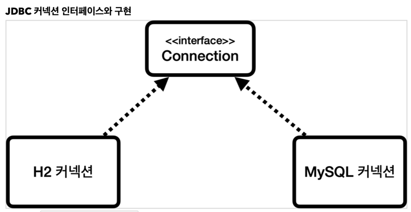
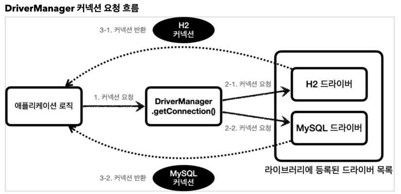

### JDBC DriverManager 연결 이해

> JDBC는 java.sql.Connection 표준 커넥션 인터페이스를 정의한다. H2 데이터베이스 드라이버는 JDBC Connection 인터페이스를 구현한 org.h2.jdbc.JdbcConnection 구현체를 제공한다.

> JDBC가 제공하는 DriverManager 는 라이브러리에 등록된 DB 드라이버들을 관리하고, 커넥션을 획득하는 기능을 제공한다.
1. 애플리케이션 로직에서 커넥션이 필요하면 DriverManager.getConnection() 을 호출한다.
2. DriverManager 는 라이브러리에 등록된 드라이버 목록을 자동으로 인식한다. 이 드라이버들에게
   순서대로 다음 정보를 넘겨서 커넥션을 획득할 수 있는지 확인한다.
   URL: 예) jdbc:h2:tcp://localhost/~/test
   이름, 비밀번호 등 접속에 필요한 추가 정보
   여기서 각각의 드라이버는 URL 정보를 체크해서 본인이 처리할 수 있는 요청인지 확인한다. 예를 들어서 URL이 jdbc:h2 로 시작하면 이것은 h2 데이터베이스에 접근하기 위한 규칙이다. 따라서 H2 드라이버는 본인이 처리할 수 있으므로 실제 데이터베이스에 연결해서 커넥션을 획득하고 이 커넥션을 클라이언트에 반환한다. 반면에 URL이 jdbc:h2 로 시작했는데 MySQL 드라이버가 먼저 실행되면 이 경우 본인이 처리할 수 없다는 결과를 반환하게 되고, 다음 드라이버에게 순서가 넘어간다.
3. 이렇게 찾은 커넥션 구현체가 클라이언트에 반환된다.
   우리는 H2 데이터베이스 드라이버만 라이브러리에 등록했기 때문에 H2 드라이버가 제공하는 H2 커넥션을 제공받는다. 물론 이 H2 커넥션은 JDBC가 제공하는 java.sql.Connection 인터페이스를 구현하고 있다.
