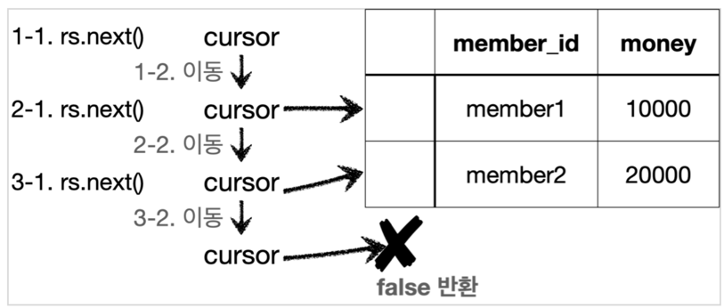

## ResultSet

### ResultSet 은 다음과 같이 생긴 데이터 구조이다. 보통 select 쿼리의 결과가 순서대로 들어간다. 예를 들어서 select member_id, money 라고 지정하면 member_id , money 라는 이름으로 데이터가 저장된다.

- 참고로 select * 을 사용하면 테이블의 모든 컬럼을 다 지정한다.
- ResultSet 내부에 있는 커서( cursor )를 이동해서 다음 데이터를 조회할 수 있다.
- rs.next() : 이것을 호출하면 커서가 다음으로 이동한다. 참고로 최초의 커서는 데이터를 가리키고 있지 않기 때문에 rs.next() 를 최초 한번은 호출해야 데이터를
  조회할 수 있다.
- rs.next() 의 결과가 true 면 커서의 이동 결과 데이터가 있다는 뜻이다.
- rs.next() 의 결과가 false 면 더이상 커서가 가리키는 데이터가 없다는 뜻이다. rs.getString("member_id") : 현재 커서가 가리키고 있는 위치의
  member_id 데이터를 String 타입으로 반환한다.
- rs.getInt("money") : 현재 커서가 가리키고 있는 위치의 money 데이터를 int 타입으로 반환한다.

## ResultSet 결과 예시



### 참고로 이 ResultSet 의 결과 예시는 회원이 2명 조회되는 경우이다.

- 1-1 에서 rs.next() 를 호출한다.
- 1-2 의 결과로 cursor 가 다음으로 이동한다. 이 경우 cursor 가 가리키는 데이터가 있으므로 true 를 반환한다.
- 2-1 에서 rs.next() 를 호출한다.
- 2-2 의 결과로 cursor 가 다음으로 이동한다. 이 경우 cursor 가 가리키는 데이터가 있으므로 true 를 반환한다.
- 3-1 에서 rs.next() 를 호출한다.
- 3-2 의 결과로 cursor 가 다음으로 이동한다. 이 경우 cursor 가 가리키는 데이터가 없으므로 false 를 반환한다.
- findById() 에서는 회원 하나를 조회하는 것이 목적이다. 따라서 조회 결과가 항상 1건이므로 while 대신에 if 를 사용한다.
    - 다음 SQL을 보면 PK인 member_id 를 항상 지정하는 것을 확인할 수 있다. SQL: select * from member where member_id = ?

### crudTest

```java

@Slf4j
class MemberRepositoryV0Test {
    MemberRepositoryV0 repository = new MemberRepositoryV0();

    @Test
    void crud() throws SQLException {
//save
        Member member = new Member("memberV0", 10000);
        repository.save(member);
//findById
        Member findMember = repository.findById(member.getMemberId());
        log.info("findMember={}", findMember);
        assertThat(findMember).isEqualTo(member);
    }
}
```

### 실행 결과

- MemberRepositoryV0Test - findMember=Member(memberId=memberV0, money=10000)
- 회원을 등록하고 그 결과를 바로 조회해서 확인해보았다.
- 참고로 실행 결과에 member 객체의 참조 값이 아니라 실제 데이터가 보이는 이유는 롬복의 @Data 가 toString() 을 적절히 오버라이딩 해서 보여주기 때문이다.
- isEqualTo() : findMember.equals(member) 를 비교한다. 결과가 참인 이유는 롬복의 @Data 는 해당 객체의 모든 필드를 사용하도록
  equals() 를 오버라이딩 하기 때문이다.

> 참고 이 테스트는 2번 실행하면 PK 중복 오류가 발생한다. 이 경우 delete from member 쿼리로 데이터를 삭제한 다음에 다시 실행하자.

PK 중복 오류

```text
  org.h2.jdbc.JdbcSQLIntegrityConstraintViolationException: Unique index or
  primary key violation: "PUBLIC.PRIMARY_KEY_8 ON PUBLIC.MEMBER(MEMBER_ID) VALUES
  9"; SQL statement:
```

```text
public void update(String memberId,int money)throws SQLException{
      String sql="update member set money=? where member_id=?";
      Connection con=null;
      PreparedStatement pstmt=null;
      try {
            con=getConnection();
            pstmt=con.prepareStatement(sql);
            pstmt.setInt(1,money);
            pstmt.setString(2,memberId);
            int resultSize=pstmt.executeUpdate();
            log.info("resultSize={}",resultSize);
        } 
        catch(SQLException e) {
            log.error("db error",e);
            throw e;
        } finally {
            close(con,pstmt,null);
        }
}
```


>executeUpdate() 는 쿼리를 실행하고 영향받은 row수를 반환한다. 여기서는 하나의 데이터만 변경하기 때문에 결과로 1이 반환된다.
>  만약 회원이 100명이고, 모든 회원의 데이터를 한번에 수정하는 update sql 을 실행하면 결과는 100이 된다.

### 회원 삭제
- 위 update 문과 거의 흡사하다. sql 만 빼고.
- String sql = "delete member where member_id=?" 
>회원을 삭제한 다음 findById() 를 통해서 조회한다.
> 회원이 없기 때문에 NoSuchElementException 이 발생한다. assertThatThrownBy 는 해당 예외가 발생해야 검증에 성공한다.
> 그런데, 만약 중간에 예외가 발생했을때는 원하는대로 비즈니스 로직이 흘러가지 않게되는데 이때문에 트랜잭션이 존재한다.