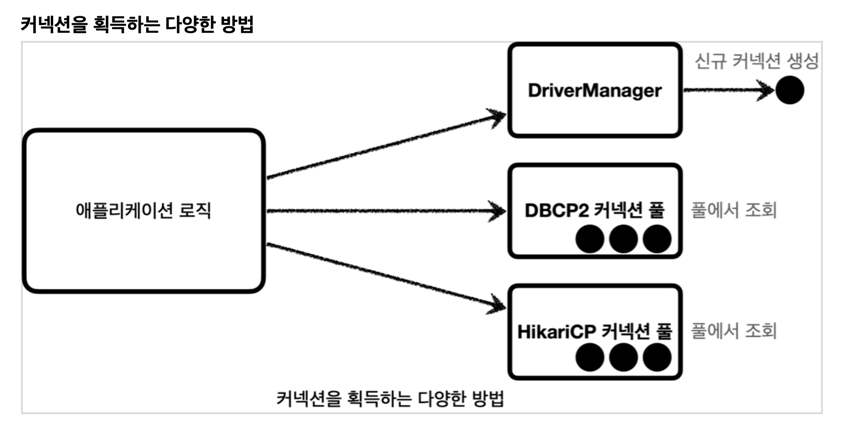
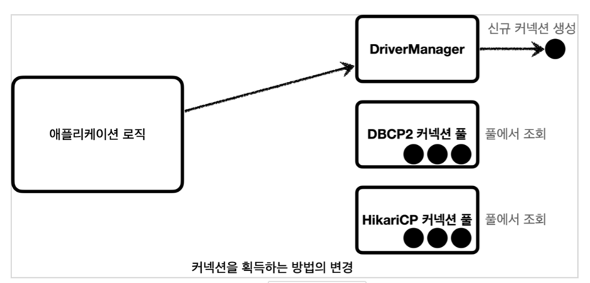
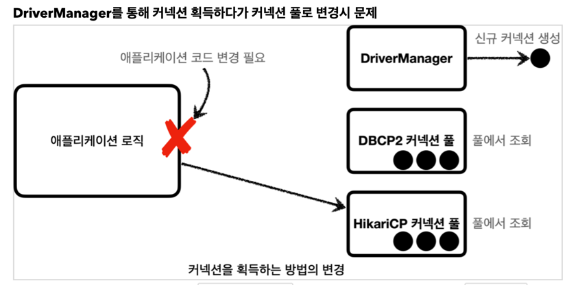
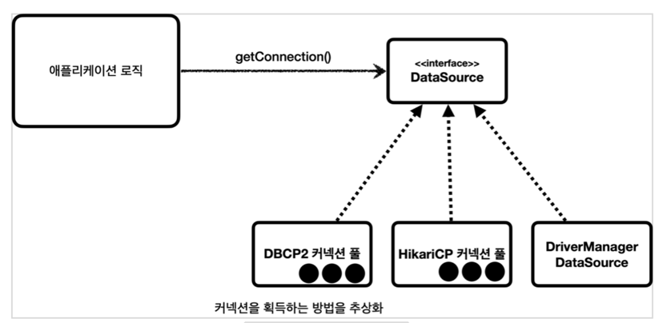

### DataSource 이해
- 커넥션을 얻는 방법은 앞서 학습한 JDBC DriverManager 를 직접 사용하거나, 커넥션 풀을 사용하는 등 다양한 방법이 존재한다.

- Driver Manager 을 이용하면 항상 신규 커넥션을 맺고 결과를 반환받는다.

- 앞서 JDBC 로 개발한 애플리케이션 처럼 DriverManager 를 통해서 커넥션을 획득하다가, 커넥션 풀을 사용하는 방법으로 변경하려면 어떻게 해야할까?

- 예를 들어서 애플리케이션 로직에서 DriverManager 를 사용해서 커넥션을 획득하다가 HikariCP 같은 커넥션 풀을 사용하도록 변경하면 커넥션을 획득하는 애플리케이션 코드도 함께 변경해야 한다.
의존관계가 DriverManager 에서 HikariCP 로 변경되기 때문이다. 물론 둘의 사용법도 조금씩 다를 것이다.

### 커넥션을 획득하는 방법을 추상화

- 자바에서는 이런 문제를 해결하기 위해 javax.sql.DataSource 라는 인터페이스를 제공한다.
- DataSource 는 커넥션을 획득하는 방법을 추상화 하는 인터페이스이다.
- 이 인터페이스의 핵심 기능은 커넥션 조회 하나이다. (다른 일부 기능도 있지만 크게 중요하지 않다.)